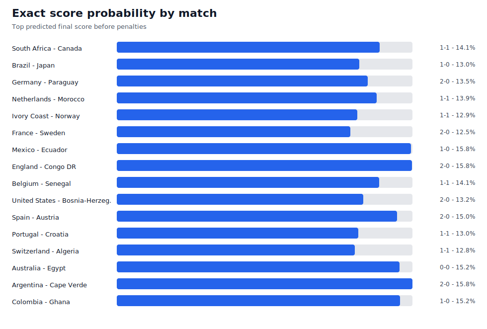
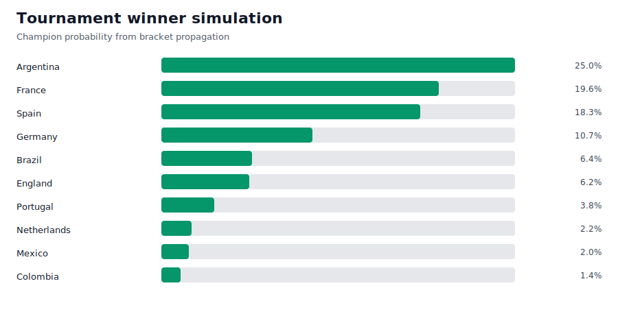
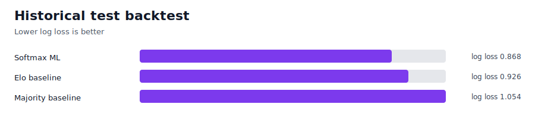

# Football Forecast Lab

Public football forecasting lab for match result, exact-score and tournament-winner probabilities.

The current live target is the 2026 World Cup round of 32, but the code is structured as a reusable pipeline:

- ESPN public data ingestion for fixtures, results, market odds, leaders and news
- World Football Elo team-strength ingestion
- optional The Odds API multi-book odds via a local free-tier key
- market-calibrated Dixon-Coles/Poisson score model with controlled context adjustments
- historical softmax ML layer trained on international results since 2000
- immutable pre-match ledger for leakage-safe backtests
- bracket propagation to estimate tournament winner probabilities
- generated dashboard, public CSV snapshots and README charts

## Quick Start

```powershell
python .\scripts\run_matchday_cycle.py
```

This refreshes live data, appends clean pre-match snapshots, resolves finished matches, analyzes odds movement, checks availability coverage, rebuilds market-edge/backtest/calibration/paper ledgers, publishes the MPP-style picks and validates generated outputs.

Main local outputs:

- `outputs/match_predictions_2026_r32.md`
- `outputs/match_predictions_2026_r32.csv`
- `outputs/champion_simulation_2026.csv`
- `outputs/feature_store_current_matches.csv`
- `outputs/football_forecast_dashboard.html`
- `outputs/match_predictions_2026_r32_audit.json`
- `outputs/ledger/pre_match_predictions.jsonl`
- `outputs/ledger/resolved_results.jsonl`
- `outputs/backtests/rolling_origin_report.md`
- `outputs/backtests/calibration_report.md`
- `outputs/mpp_picks_current.md`
- `outputs/mpp_picks_current.csv`
- `outputs/odds_movement_current.md`
- `outputs/availability_report_current.md`
- `outputs/market_edges_current.md`
- `outputs/paper_bets/current_ledger.csv`

Public snapshots copied into the repo live under `docs/generated/`.

## Data Sources

- [ESPN public soccer endpoints](https://site.api.espn.com/apis/site/v2/sports/soccer/fifa.world/scoreboard) for fixtures, summaries, market odds and news
- [World Football Elo](https://www.eloratings.net/) for team-strength ratings
- [The Odds API v4](https://the-odds-api.com/liveapi/guides/v4/) for optional multi-book h2h/totals odds and quota headers
- [API-Football](https://www.api-football.com/) as the next keyed source for lineups, injuries, player stats and extra odds
- [football-data.org](https://www.football-data.org/documentation/api) as a possible fixtures/results supplement, not a primary odds source

## Secure API Keys

Never paste API keys in chat, issues, commits or shell history. Use the local masked prompt:

```powershell
.\scripts\set_secret.ps1 -Name THE_ODDS_API_KEY
```

The script writes the value to `.env`, which is ignored by Git. Optional non-secret knobs:

```powershell
THE_ODDS_API_REGIONS=eu,uk
THE_ODDS_API_MARKETS=h2h,totals
```

The default request is intentionally modest for the free tier. The pipeline reads The Odds API quota headers when available and stores only counts such as remaining/used credits.

API-Football fixture mapping is enabled when `API_FOOTBALL_KEY` is present. Detail calls for injuries, lineups and player stats are off by default to protect the free quota. Enable them explicitly only near match windows:

```powershell
$env:API_FOOTBALL_ENABLE_DETAIL_CALLS = "1"
$env:API_FOOTBALL_DETAIL_CALL_LIMIT = "12"
```

## Refresh Loop

For an aggressive local monitor with a quota safety stop:

```powershell
python .\scripts\watch_refresh.py --minutes 30 --min-odds-credits 25
```

With a 500-credit free monthly plan, do not run a high-cost odds call every few minutes for weeks. The practical pattern is frequent refresh near match windows, slower refresh outside them, and a hard minimum-credit stop.

## Validation

```powershell
python .\scripts\train_ml.py
python -m compileall -q .\src .\scripts .\tests
python -m unittest discover -s tests
python .\scripts\validate_outputs.py
python .\scripts\resolve_results.py
python .\scripts\analyze_odds_movement.py
python .\scripts\build_availability_report.py
python .\scripts\build_market_edges.py
python .\scripts\backtest_models.py
python .\scripts\calibrate_models.py
python .\scripts\paper_bet.py
python .\scripts\build_mpp_picks.py
python .\scripts\build_readme_assets.py
```

Optional ML dependencies for future LightGBM/scikit-learn work:

```powershell
python -m pip install -e ".[ml]"
```

## Model

The live model is market-calibrated first and ML-assisted second:

1. convert 1X2 and totals odds into fair probabilities
2. blend optional multi-book odds when a local key is configured
3. fit a Dixon-Coles-adjusted score distribution for 90-minute exact scores
4. adjust modestly with Elo, group form, rest and player leaders
5. publish a separate after-extra-time distribution for knockout formats
6. attach historical ML probabilities as an advisory signal
7. propagate the bracket to champion probabilities

The recommended exact score in the main forecast table is the most likely **90-minute** score. The MPP-style pick uses the separate after-extra-time distribution, before penalties. These scopes must not be mixed in backtests.

## Betting-Agent Direction

This repo is a decision-support lab, not an automatic real-money betting bot. A future bankroll agent should start with paper trading, stake caps, daily loss limits, model-vs-market edge thresholds, quota tracking and human confirmation before any real-money action.

Exact scorer forecasts are a separate, harder model: they need expected minutes, lineups, injuries/suspensions, penalty and set-piece roles, recent shot/xG volume and player prop odds. Until those inputs are reliable, publishing scorer picks would be fake precision.

See `MODEL_CARD.md` and `docs/ROADMAP_15.md` for the current model limits and next steps.

<!-- forecast-snapshot:start -->

## Public Snapshot







Generated UTC: `2026-06-30T18:16:38.747411+00:00`

## Match Forecasts

| Match | Status | Result 90 | P(result) | Score 90 | P(score) |
|---|---|---|---:|---:|---:|
| South Africa - Canada | after_kickoff_or_unknown | Canada gagne | 36.2% | 1-1 | 14.1% |
| Brazil - Japan | after_kickoff_or_unknown | Brazil gagne | 40.4% | 1-1 | 14.0% |
| Germany - Paraguay | after_kickoff_or_unknown | Germany gagne | 41.2% | 1-1 | 14.0% |
| Netherlands - Morocco | after_kickoff_or_unknown | Netherlands gagne | 38.1% | 1-1 | 14.1% |
| Ivory Coast - Norway | after_kickoff_or_unknown | Norway gagne | 44.1% | 1-1 | 13.2% |
| France - Sweden | pre_match | France gagne | 77.7% | 2-0 | 10.9% |
| Mexico - Ecuador | pre_match | Mexico gagne | 46.0% | 1-0 | 16.9% |
| England - Congo DR | pre_match | England gagne | 73.8% | 2-0 | 16.3% |
| Belgium - Senegal | pre_match | Belgium gagne | 42.6% | 1-1 | 13.9% |
| United States - Bosnia-Herzegovina | pre_match | United States gagne | 67.1% | 2-0 | 13.0% |
| Spain - Austria | pre_match | Spain gagne | 71.4% | 2-0 | 14.3% |
| Portugal - Croatia | pre_match | Portugal gagne | 53.1% | 1-1 | 12.8% |
| Switzerland - Algeria | pre_match | Switzerland gagne | 51.3% | 1-1 | 13.1% |
| Australia - Egypt | pre_match | Egypt gagne | 38.4% | 0-0 | 15.2% |
| Argentina - Cape Verde | pre_match | Argentina gagne | 82.7% | 2-0 | 16.6% |
| Colombia - Ghana | pre_match | Colombia gagne | 63.6% | 1-0 | 15.3% |

## Tournament Simulation

| Rank | Team | Champion | Final | Semi |
|---:|---|---:|---:|---:|
| 1 | Argentina | 27.0% | 39.5% | 66.8% |
| 2 | France | 21.2% | 30.7% | 49.9% |
| 3 | Spain | 19.8% | 38.4% | 50.2% |
| 4 | England | 7.1% | 12.8% | 26.6% |
| 5 | Brazil | 6.3% | 16.7% | 34.6% |
| 6 | Portugal | 5.0% | 13.4% | 20.8% |
| 7 | Germany | 2.4% | 8.9% | 24.3% |
| 8 | Mexico | 2.2% | 4.7% | 11.5% |
| 9 | Colombia | 1.6% | 4.3% | 15.8% |
| 10 | Netherlands | 1.3% | 3.0% | 7.7% |

## Historical ML Backtest

Rows: train `18164`, validation `3581`, test `3670`.

| Model | Accuracy | Brier | Log loss |
|---|---:|---:|---:|
| Softmax ML | 0.606 | 0.510 | 0.868 |
| Elo baseline | 0.605 | 0.542 | 0.926 |
| Majority baseline | 0.472 | 0.636 | 1.054 |

## MPP-Style Picks

Current single-score picks are published in [`docs/generated/mpp_picks_current.md`](docs/generated/mpp_picks_current.md).

## Resolved Results

Resolved final scores used for live evaluation are published in [`docs/generated/resolved_results.csv`](docs/generated/resolved_results.csv).

## Market Discipline

Market-edge candidates, odds movement and availability coverage are published in [`docs/generated/market_edges_current.md`](docs/generated/market_edges_current.md), [`docs/generated/odds_movement_current.md`](docs/generated/odds_movement_current.md) and [`docs/generated/availability_report_current.md`](docs/generated/availability_report_current.md).

<!-- forecast-snapshot:end -->
